**Keane Chan Jun Yu** <br>
**A0205678W**

GitHub Repo: [https://github.com/keanecjy/CS3219-TaskA3](https://github.com/keanecjy/CS3219-TaskA3)

# CS3219-TaskA3 - Ingress Controller

## Deployment

Verify that NGINX Ingress controller is up
```shell
kubectl get pods -n ingress-nginx
```

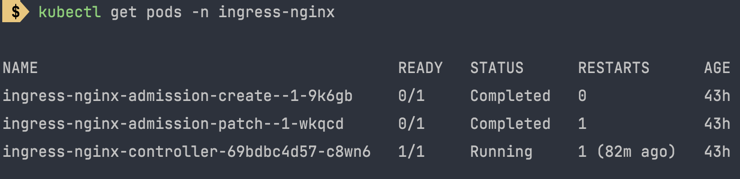

Deploy and create service
```shell
kubectl apply -f deployment.yml
```

```shell
kubectl get deployments
```
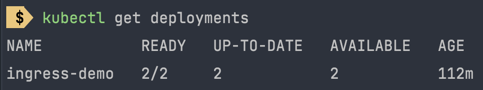

```shell
kubectl get service
```
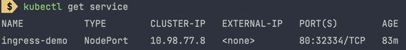

Add Ingress controller. It can take awhile for the ip address to be set.
```shell
kubectl apply -f ingress.yml
kubectl get ingress
```
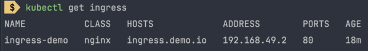

Using this ip address, go to /etc/hosts file and add `<IP_ADDRESS> ingress.demo.io` at the bottom of the file.

Now we can access the endpoint at [https://ingress.demo.io](https://ingress.demo.io)
```shell
curl -I https://ingress.demo.io
```

# CS3219-TaskA3 - Horizontal pod auto-scaler

Create deployment, expose it and attach service
```shell
kubectl apply -f hpa.yml
```

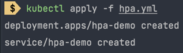

Check if deployment exist
```shell
kubectl get deployments
```

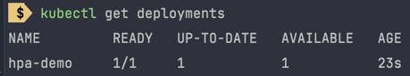

Create hpa
```shell
kubectl autoscale deployment hpa-demo --cpu-percent=50 --min=1 --max=10
```
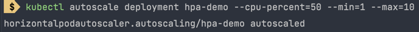

Check status of autoscaler (might take some time to show %). We should expect 0% since we are not sending any requests to the server.
```shell
kubectl get hpa
```

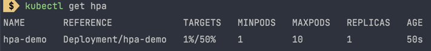

Increase load on the service
```shell
kubectl run -i --tty load-generator --rm --image=busybox --restart=Never -- /bin/sh -c "while sleep 0.01; do wget -q -O- http://hpa-demo; done"
```

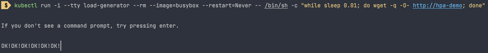

Open up a new terminal. After 1 minute, we should see higher cpu load:
```shell
kubectl get hpa
```
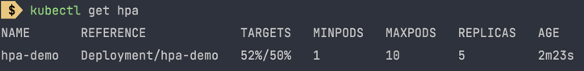

We should also see more replicas created for the deployment
```shell
kubectl get deployment hpa-demo
```

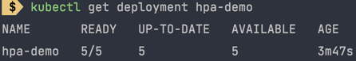

Now we stop the container with the busybox image using Ctrl-C (SIGINT). After 1 minute or so, cpu utilization will drop back to 0%
```shell
kubectl get hpa
```

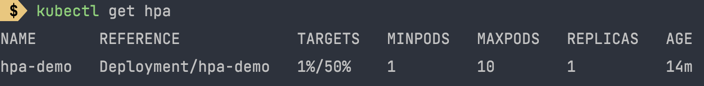

After several minutes, the HPA will autoscale and decrease the no. of replicas down to 1.
```shell
kubectl get deployment hpa-demo
```

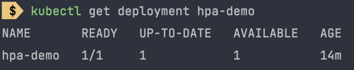

# Resources
1. [https://kubernetes.io/docs/tasks/run-application/horizontal-pod-autoscale-walkthrough/](https://kubernetes.io/docs/tasks/run-application/horizontal-pod-autoscale-walkthrough/)
```
kubectl apply -f https://github.com/kubernetes-sigs/metrics-server/releases/latest/download/components.yaml
```
